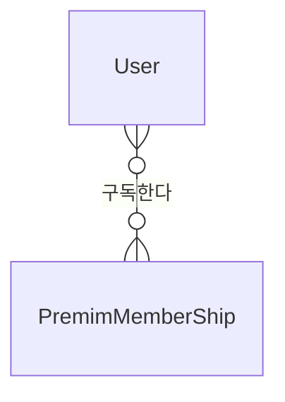

## Foreign Key란?
테이블을 참조할수있게 하는 연결고리 역할을 하는것이 외래키이다.
데이터베이스 구조와 테이블 간의 관계를 파악하기가 훨씬 수월하다.

## 조인할 때 테이블에 alias붙이기
```sql
SELECT 
	i.id,
	i.name,
	s.item_id,
	s.inverntory_count
FROM item AS i RIGHT OUTER JOIN stock AS s
ON i.id = s.item_id
```

학생, 학교, 학과, 교수, 강의

학생: 학번,이름,나이,성별,전화번호,이메일,입학날짜(등록일),업데이트날짜(휴학),삭제날짜(자퇴)

교수: 아이디, 이름,나이,성별,전화번호,이메일, 만든날짜, 업데이트날짜, 삭제날짜

학교: 아이디, 학생아이디, , 학과아이디

학과: 아이디, 이름 , 교수님아이디,학생학번




